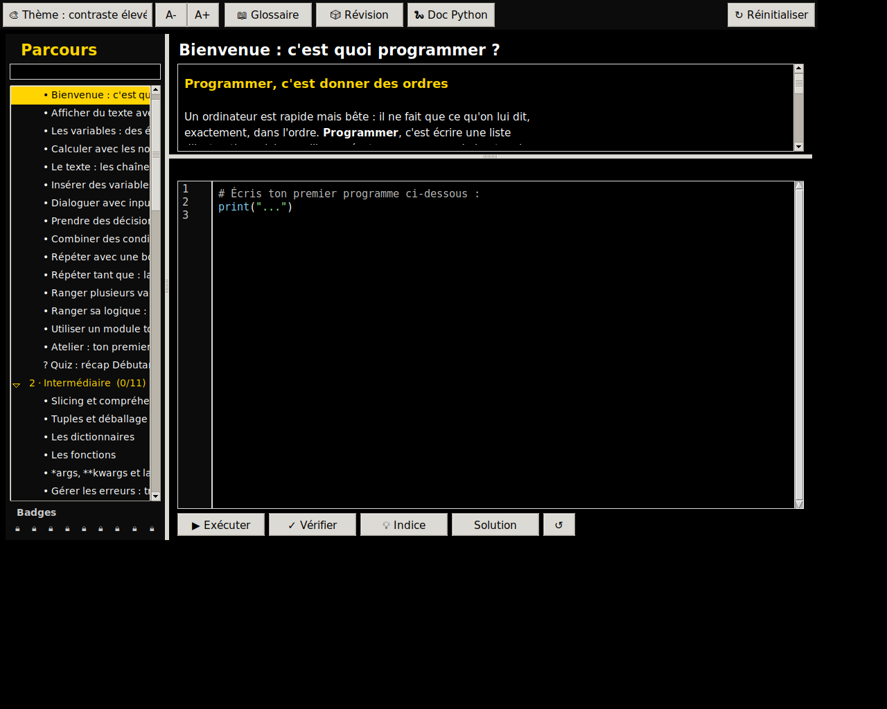
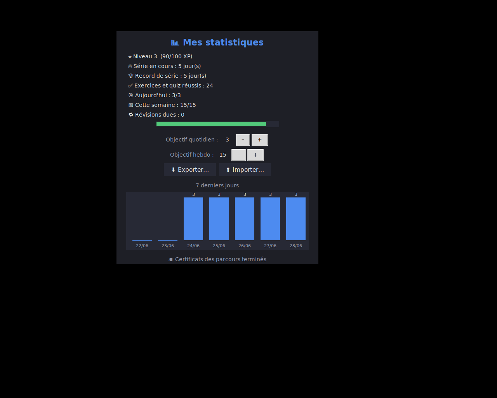
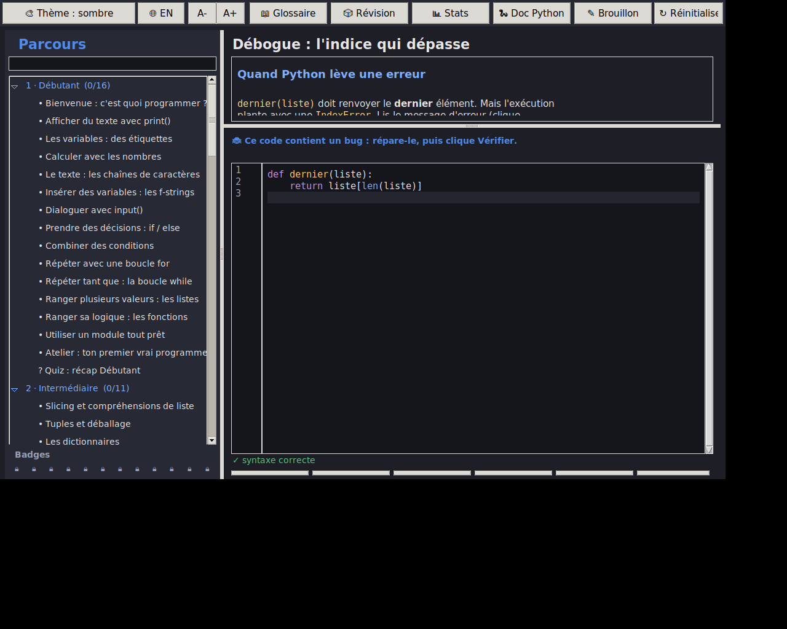
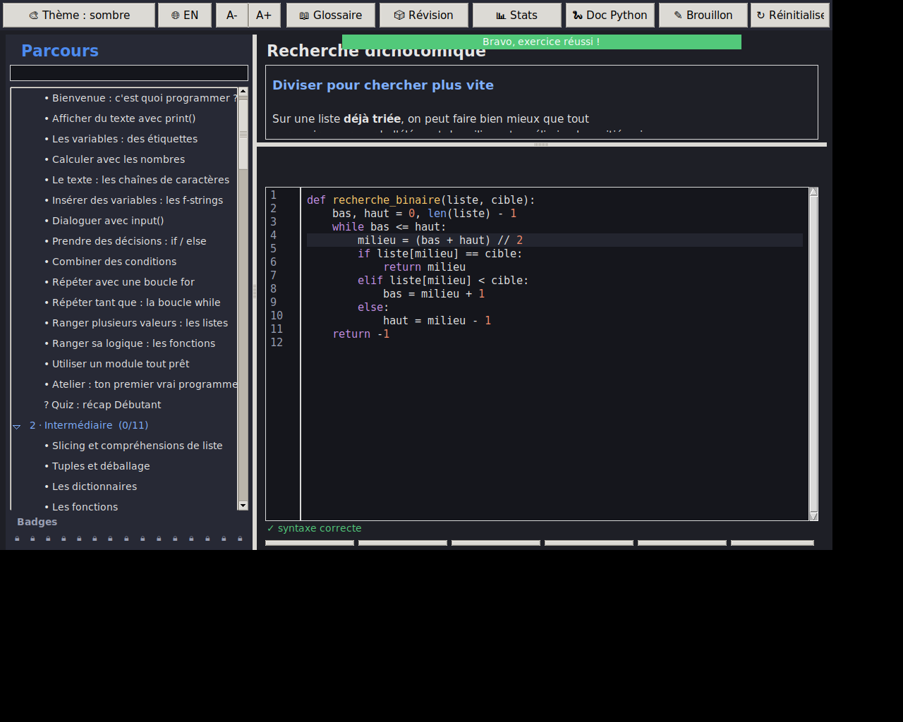
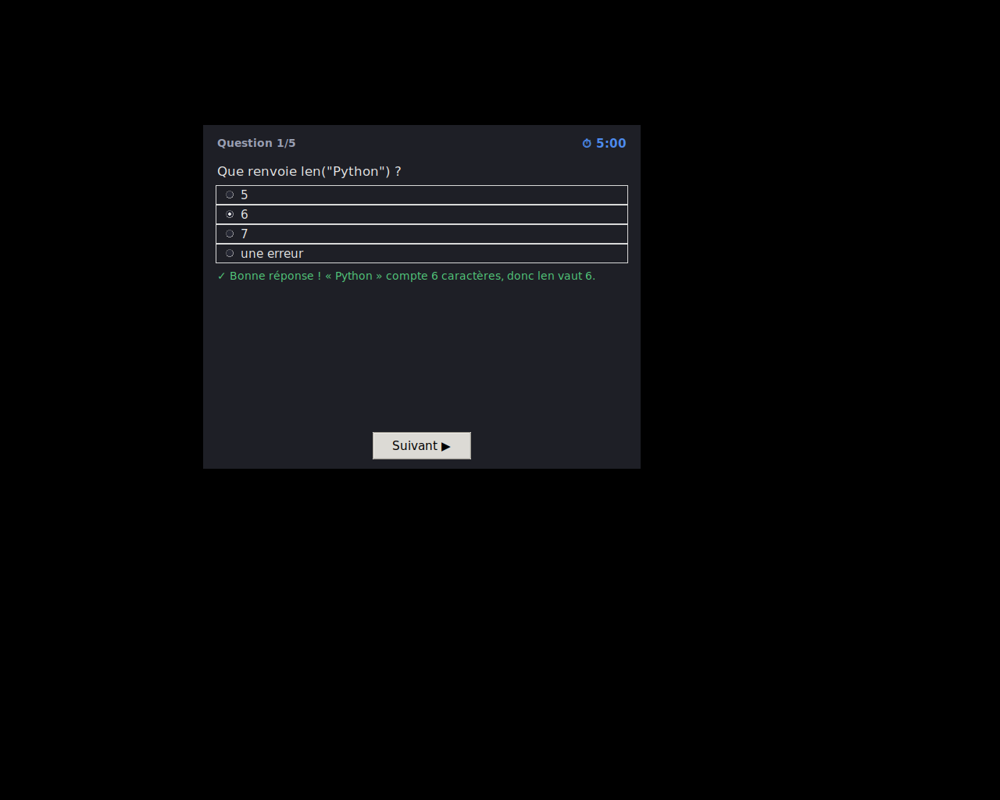
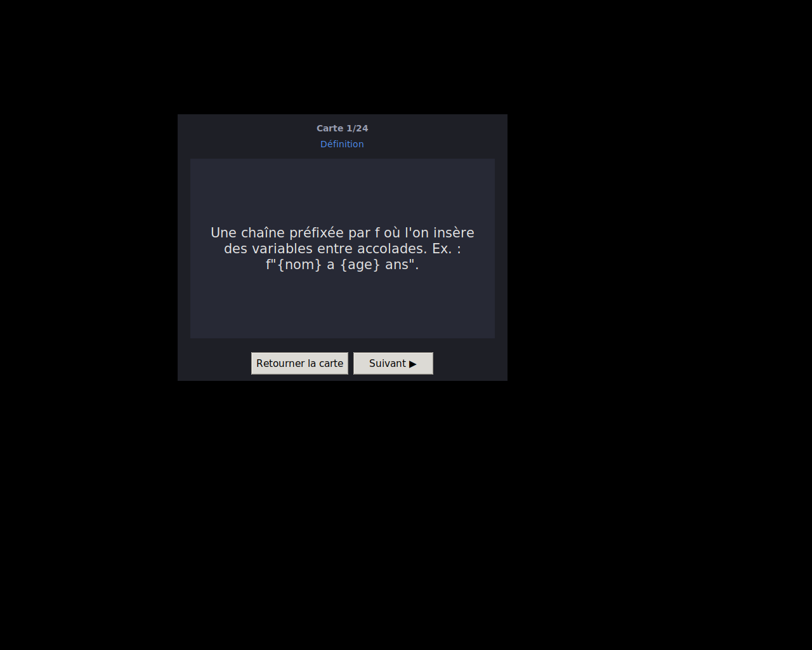
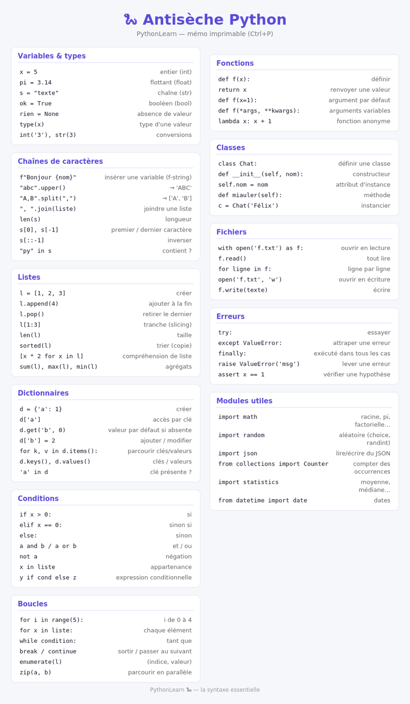

# PythonLearn 🐍

Une application de bureau pour **apprendre Python pas à pas, du niveau
débutant au niveau expert**. Chaque leçon mêle une explication claire et
un exercice que l'on résout dans un éditeur intégré : le code s'exécute
pour de vrai et la réussite est vérifiée automatiquement.

- ✅ Parcours structuré : **15 parcours, 132 exercices**, du tout débutant aux projets concrets
- ✅ Éditeur intégré avec **coloration syntaxique**, **numéros de ligne** et **exécution réelle**
- ✅ **Syntaxe vérifiée en temps réel** (ligne fautive soulignée), **autocomplétion** (Ctrl+Espace)
- ✅ **Exécution pas-à-pas** : avance ligne par ligne en voyant les variables et la sortie évoluer
- ✅ **Export** du code d'un exercice en fichier `.py`
- ✅ Confort visuel : **surlignage de la ligne courante**, titres de leçons complets au survol, splash screen en fondu
- ✅ Interface soignée : **boutons d'action en couleur d'accent** avec effet de survol, **bannière de réussite animée**, barres de progression (global + niveau)
- ✅ **Vérification automatique** des exercices, avec **messages d'erreur expliqués en français**
- ✅ **Inspecteur de variables** après exécution + **comparaison attendu/obtenu** en cas d'échec
- ✅ **Bac à sable** libre (« Brouillon ») pour expérimenter sans exercice
- ✅ **Indices progressifs** (dévoilés un par un) avant de révéler la solution
- ✅ **Quiz (QCM) à la fin de chaque parcours** et **projets guidés multi-étapes**
- ✅ Exercices variés : à compléter (**trous**) et à réparer (**débogue ce code**), en plus des exercices classiques
- ✅ **3 thèmes** (sombre / clair / contraste élevé) + **zoom** du texte
- ✅ **Glossaire** intégré, **mode révision**, **recherche** de leçon, lien vers la doc Python
- ✅ **Antisèche imprimable** (mémo de syntaxe HTML) et **flashcards** de révision
- ✅ **Suivi de progression** (barre + compteurs par parcours) et **badges** par parcours
- ✅ **Série de jours (streak)**, objectif quotidien et **statistiques** (graphique 7 jours)
- ✅ **XP & niveaux**, **objectif hebdomadaire**, et **recommandation adaptative** (« 🧭 Et après ? »)
- ✅ **Notes personnelles** et **favoris** par leçon (marqueurs ★ / 📝 dans la liste)
- ✅ **Mode examen chronométré** (questions au hasard, 5 minutes, score final)
- ✅ **Export / import de la progression** en JSON (pour changer de machine)
- ✅ **Révision espacée** : les exercices reviennent à intervalles croissants (1, 3, 7, 16… jours)
- ✅ **Certificat** de fin de parcours (HTML imprimable, à ton nom)
- ✅ Confort d'édition : auto-fermeture des parenthèses, `Ctrl+/` pour commenter, indentation de bloc
- ✅ **Interface bilingue FR / EN** (bascule en un clic ; le contenu des leçons reste en français)
- ✅ **Packs de leçons** : ajoute tes propres exercices avec un simple
  fichier `.json`, sans écrire une ligne de code (idéal en classe)
- ✅ **Zéro dépendance** pour l'utilisateur (tout est en bibliothèque standard)
- ✅ **Bac à sable sécurisé** : le « Brouillon » limite les modules importables et l'accès fichier/système
- ✅ **Tests automatisés** du curriculum (les 132 solutions sont vérifiées par la CI)
- ✅ **Installateurs** Windows (.exe), macOS (.dmg Apple Silicon)
  et Linux (.deb + archive) générés **automatiquement** par GitHub Actions

|  Thème sombre  |  Thème clair  |  Quiz (contraste élevé)  |
|:---:|:---:|:---:|
|  |  |  |

> *Captures réalisées en environnement de test ; les emojis des badges
> s'affichent normalement sur Windows et macOS.*

Le tableau de bord **Stats** (série, objectif, graphique 7 jours, révisions, certificats) :



L'**exécution pas-à-pas** (ligne courante surlignée, variables et sortie à chaque étape) :


L'**interface bilingue** — ici en anglais (le contenu des leçons reste en français) :


Le mode **« débogue ce code »** (bandeau dédié, bug réel à réparer) :



Le parcours **Algorithmes & structures de données** (ici la recherche dichotomique) :



Le **mode examen** chronométré (questions au hasard, score final) :



Les **flashcards** de révision (recto terme / verso définition) et l'**antisèche** imprimable :





## ⌨️ Raccourcis

| Raccourci | Action |
|-----------|--------|
| `Ctrl + Entrée` | Exécuter le code |
| `Ctrl + Espace` | Autocomplétion (mots-clés et noms du code) |
| `Ctrl + /` | Commenter / décommenter la sélection |
| `Tab` / `Maj + Tab` | Indenter / désindenter la sélection |
| `Ctrl + +` / `Ctrl + -` / `Ctrl + 0` | Zoom avant / arrière / réinitialiser |

## 📚 Les parcours

Chaque parcours de cours se termine par un **quiz de récap**. Le dernier
parcours est entièrement consacré aux **projets guidés**.

**Fondamentaux**
1. **Débutant** — afficher, variables, calculs, texte, `input()`, conditions, boucles, listes, fonctions, modules, atelier + quiz.
2. **Intermédiaire** — slicing, compréhensions, tuples, dictionnaires, fonctions avancées, ensembles, modules, tri, exceptions + quiz.
3. **Avancé** — générateurs, POO complète, décorateurs, propriétés, fichiers, expressions régulières + quiz.
4. **Expert** — gestionnaires de contexte, dataclasses, `functools`, async, ABC, tests unitaires, `itertools` + quiz.

**Parcours pratiques (orientés projets)**

5. **Scripts & automatisation** — scripts, `pathlib`, fichiers, JSON, CSV, dates + quiz.
6. **Interfaces graphiques** — créer des fenêtres et des apps avec Tkinter + quiz.
7. **Python & le web** — HTTP, générer du HTML, lire une API, mini-serveur, Flask/Django + quiz.
8. **Administrer son PC** — système, variables d'environnement, fichiers, ranger un dossier + quiz.
9. **Bases de données (SQLite)** — créer une table, INSERT, SELECT, WHERE, UPDATE/DELETE, agrégats + quiz.
10. **Dessiner (turtle)** — polygones, motifs, spirales, coordonnées, rosace + quiz.

**Approfondissement**

11. **Algorithmes & structures de données** — recherche linéaire et dichotomique, tri à bulles, récursivité (factorielle, Fibonacci), pile (LIFO), file (FIFO) + quiz.
12. **Manipuler des données** — `statistics` (moyenne, médiane), `Counter`, `defaultdict`, lire un CSV, agréger des données + quiz.
13. **Tests & TDD** — `assert`, lire un test comme une spécification, cas limites, cycle rouge-vert-refactor, écrire ses propres tests + quiz.

**Projets guidés** (multi-étapes, validés exercice par exercice)

14. **Projets guidés** — le **Pendu**, une **liste de tâches**, un **bloc-notes** Tkinter, un **convertisseur de devises**, le **Jeu de la vie** de Conway, et le **hachage sécurisé** d'un mot de passe.
15. **Entraînement (débogage & trous)** — réparer des bugs classiques (borne, condition inversée, IndexError) et compléter du code à trous.

---

## 🚀 Lancer l'application depuis les sources

Il suffit d'avoir Python 3.10 ou plus.

```bash
git clone https://github.com/<ton-compte>/python-learn.git
cd python-learn
python main.py
```

> **Linux** : si tkinter manque, installe-le avec
> `sudo apt install python3-tk`.
> **Windows / macOS** : tkinter est inclus avec l'installateur officiel
> de [python.org](https://www.python.org/downloads/).

---

## 📦 Installer l'application (rien à compiler)

Va dans l'onglet **[Releases](../../releases)** et prends le fichier qui
correspond à ton système. **Python n'a pas besoin d'être installé** : tout
est embarqué dans le téléchargement.

| Système | Fichier | Installation |
|---|---|---|
| **Windows** | `PythonLearn-Setup-<version>.exe` | Double-clic. S'installe pour ton compte, sans droits administrateur. |
| Windows, sans installer | `PythonLearn-<version>-windows-portable.exe` | Se lance directement depuis le fichier téléchargé. |
| **macOS** Apple Silicon | `PythonLearn-<version>-arm64.dmg` | Glisse l'app dans Applications, puis **clic droit → Ouvrir** au premier lancement. |
| **macOS** Intel | *(aucun)* | Voir la note ci-dessous. |
| **Debian / Ubuntu / Mint** | `python-learn_<version>_amd64.deb` | `sudo apt install ./python-learn_<version>_amd64.deb` |
| **Autres Linux** | `python-learn-<version>-linux-amd64.tar.gz` | Décompresse, puis `bash installer.sh` (aucun `sudo` requis). |

Le fichier `SHA256SUMS.txt` joint à chaque Release permet de vérifier
l'intégrité de ce que tu as téléchargé.

> **Pourquoi rien pour les Mac Intel ?** GitHub a retiré les machines de
> construction Intel, et un binaire Apple Silicon ne démarre pas sur un
> processeur Intel. Ces Mac restent parfaitement servis par les sources :
> installe Python depuis [python.org](https://www.python.org/downloads/),
> puis lance `python main.py` (voir plus bas). C'est la même application.

### Les avertissements de sécurité, en clair

L'application n'est signée par aucun certificat payant. Les systèmes
préviennent donc l'utilisateur au premier lancement — c'est attendu, et sans
danger :

- **Windows** : *« Windows a protégé votre ordinateur »* →
  *Informations complémentaires* → *Exécuter quand même*.
- **macOS** : au premier lancement, **clic droit sur l'app → Ouvrir** (un
  double-clic ne proposerait pas l'option). Si macOS annonce que l'application
  est « endommagée » :
  `xattr -dr com.apple.quarantine /Applications/PythonLearn.app`.

---

## 🚢 Publier une nouvelle version

Tout est automatisé par GitHub Actions ; il n'y a rien à compiler soi-même.

1. Mettre à jour le numéro dans [`app/version.py`](app/version.py).
2. Committer, puis poser le tag correspondant :
   ```bash
   git tag v1.1.0
   git push origin v1.1.0
   ```
3. Le workflow `build.yml` lance les tests, construit les cinq fichiers
   d'installation (Windows, macOS, Linux), vérifie chaque exécutable
   produit, puis crée la **Release** avec ses empreintes.

> Le tag doit correspondre exactement à `app/version.py` : sinon la CI
> s'arrête avec un message explicite, plutôt que de publier une version mal
> étiquetée.

Pour essayer la chaîne sans rien publier : onglet **Actions** →
*Construire les installateurs* → **Run workflow**. Les fichiers sont alors
déposés en artefacts, sans créer de Release.

Le détail (signature de code, notarisation Apple, Inno Setup) est dans
**[DIFFUSION.md](DIFFUSION.md)**.

---

## 🎒 Créer ses propres leçons (sans programmer)

Tu peux ajouter tes propres parcours **sans toucher au code**, en déposant
un simple fichier `.json`. C'est pensé pour les enseignants : tes exercices
viennent s'ajouter aux 15 parcours livrés, et se partagent en envoyant un
seul fichier.

**Depuis l'application** — clique sur **📦 Mes leçons** dans la barre du
haut. Le dossier s'ouvre dans l'explorateur, avec un exemple à modifier.
Relance PythonLearn : ton parcours apparaît dans la liste, précédé de 📦.

**Depuis un terminal**, si tu travailles à partir des sources :

```bash
python main.py --exemple-pack
```

```bash
python main.py --verifier-packs
```

Tu peux aussi partir du fichier [`exemples/mon-cours.json`](exemples/mon-cours.json).

### À quoi ressemble un fichier de leçons

```json
{
  "format": 1,
  "id": "mon-cours",
  "titre": "Mon cours",
  "auteur": "Prénom Nom",
  "lecons": [
    {
      "id": "moncours-01",
      "title": "Afficher un message",
      "content": "## Afficher du texte\n\nLa fonction `print()` affiche...",
      "starter": "# Écris ton code ici\n",
      "expected_output": "Bonjour la classe",
      "solution": "print('Bonjour la classe')\n",
      "hints": ["Utilise print(...).", "Le texte va entre guillemets."]
    }
  ]
}
```

| Champ | Rôle |
|---|---|
| `id` | identifiant unique du parcours, puis de chaque leçon |
| `titre` | nom affiché dans la liste des parcours |
| `auteur` | facultatif, affiché à la vérification |
| `content` | l'explication (même balisage que les leçons livrées, voir plus bas) |
| `starter` | le code déjà présent dans l'éditeur au départ |
| `expected_output` | la sortie attendue, **ou** … |
| `check` | … du code de test (`assert ...`) exécuté après celui de l'élève |
| `solution` | la solution révélable |
| `hints` | les indices, dévoilés un par un |

Une leçon peut aussi être un **quiz** (`"type": "quiz"` avec `question`,
`options` et `answer`, le numéro de la bonne option en partant de 0), ou un
**projet en plusieurs étapes** (une liste `exercices`). Le détail des champs
est dans la section suivante : le format est exactement le même que celui
des parcours livrés avec l'application.

### Vérifier son travail

`--verifier-packs` dit précisément ce qui ne va pas, sans jargon :

```
1 fichier(s) trouvé(s), 1 parcours utilisable(s).
  OK   mon-cours            3 leçon(s) — Prénom Nom

Points à corriger :
  - mon-cours.json — leçon 2 (« moncours-02 ») : « answer » vaut 5, mais il
    n'y a que 3 options (numérotées de 0 à 2). Quiz écarté : personne ne
    pourrait le réussir.
```

Un fichier mal formé n'empêche jamais l'application de démarrer : les leçons
en cause sont écartées, les autres sont chargées, et un message récapitule
ce qu'il faut corriger.

> ⚠️ **Un pack contient du code qui s'exécutera sur la machine de
> l'apprenant** (les champs `check` et `solution`), au moment où il clique
> sur « Vérifier » ou « Solution ». N'installe que des packs dont tu connais
> la provenance, comme pour n'importe quel programme. Rien n'est exécuté au
> simple chargement du fichier.

---

## ➕ Ajouter ou modifier des leçons

Tout le contenu pédagogique vit dans le dossier `content/`, un fichier
par niveau. Pour ajouter une leçon, ajoute simplement un dictionnaire à
la liste `lessons` du niveau voulu :

```python
{
    "id": "deb-08",                      # identifiant unique
    "title": "Ma nouvelle leçon",
    "content": "## Titre\n\nDu texte...\n```\nprint('exemple')\n```",
    "starter": "# code de départ\n",
    "expected_output": "résultat attendu",   # OU
    "check": "assert resultat == 42",        # code de test
    "solution": "resultat = 42\n",           # solution révélable
}
```

L'interface se met à jour automatiquement — aucune autre modification
n'est requise.

**Mini-balisage du champ `content` :**

| Syntaxe          | Rendu                          |
|------------------|--------------------------------|
| `## Titre`       | Sous-titre                     |
| `` ```...``` ``  | Bloc de code (monospace)       |
| `` `code` ``     | Code en ligne                  |
| `**gras**`       | Texte en gras                  |
| `- élément`      | Puce                           |

**Modes de validation d'un exercice :**

- `expected_output` : la sortie texte doit correspondre exactement ;
- `check` : du code Python exécuté ensuite (`assert ...`), avec accès aux
  variables/fonctions définies par l'apprenant ;
- `stdin` : liste de lignes simulant la saisie clavier (`input()`).

**Champs avancés (facultatifs) :**

- `hints` : liste d'indices dévoilés un par un (ou via `content/hints.py`) ;
- `type: "quiz"` + `question`, `options`, `answer` (index), `explanation` : une leçon QCM ;
- `exercices` : liste d'exercices (`prompt`, `starter`, `check`/`expected_output`,
  `solution`, `hints`) pour un projet multi-étapes affiché avec des onglets.

---

## 🗂️ Structure du projet

```
python-learn/
├── main.py                  # point d'entrée (--version, --check)
├── pyproject.toml           # métadonnées + configuration de ruff
├── .github/workflows/
│   ├── tests.yml            # tests + style (3 systèmes × 2 versions de Python)
│   └── build.yml            # installateurs Windows / macOS / Linux + Release
├── app/
│   ├── ui.py                # interface principale
│   ├── theme.py             # les 3 palettes de couleurs
│   ├── windows.py           # fenêtres : pas-à-pas, examen, flashcards…
│   ├── editor.py            # éditeur (coloration, n° de ligne, confort)
│   ├── runner.py            # exécution + vérification + bac à sable
│   ├── errors.py            # explication pédagogique des erreurs (FR / EN)
│   ├── stats.py             # streak, répétition espacée, certificat
│   ├── i18n.py              # traductions FR / EN de l'interface
│   ├── progress.py          # sauvegarde (atomique) de la progression
│   ├── version.py           # numéro de version, source unique
│   └── icon.py              # icône embarquée (base64)
├── exemples/
│   └── mon-cours.json       # pack de leçons d'exemple, à copier
├── content/
│   ├── __init__.py          # agrégation + utilitaires du schéma
│   ├── packs.py             # leçons ajoutées par l'utilisateur (.json)
│   ├── debutant.py … admin.py   # les 8 parcours de cours
│   ├── sqlite_db.py         # parcours Bases de données (SQLite)
│   ├── dessin.py            # parcours Dessiner (turtle)
│   ├── projets.py           # projets guidés multi-exercices
│   ├── quiz_parcours.py     # un quiz de fin par parcours (injecté auto)
│   ├── hints.py             # indices progressifs
│   └── glossaire.py         # termes du glossaire
├── packaging/
│   ├── installer.iss        # installateur Windows (Inno Setup)
│   ├── linux/               # paquet .deb + archive autonome
│   └── macos/               # disque d'installation .dmg
├── assets/                  # icônes + captures
├── tests/                   # tests du curriculum, du moteur et des traductions
├── requirements.txt
├── requirements-dev.txt
└── README.md
```

La progression est stockée dans `~/.python-learn/progress.json`
(dossier personnel de l'utilisateur).

---

## 📜 Licence

MIT — voir le fichier [LICENSE](LICENSE).
