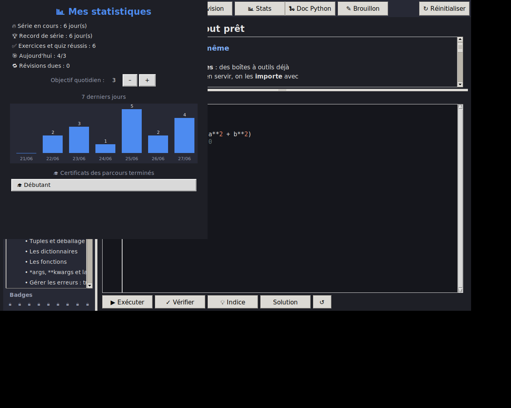
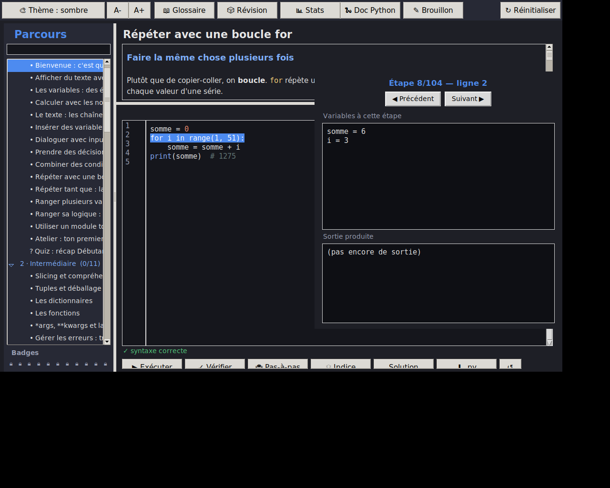
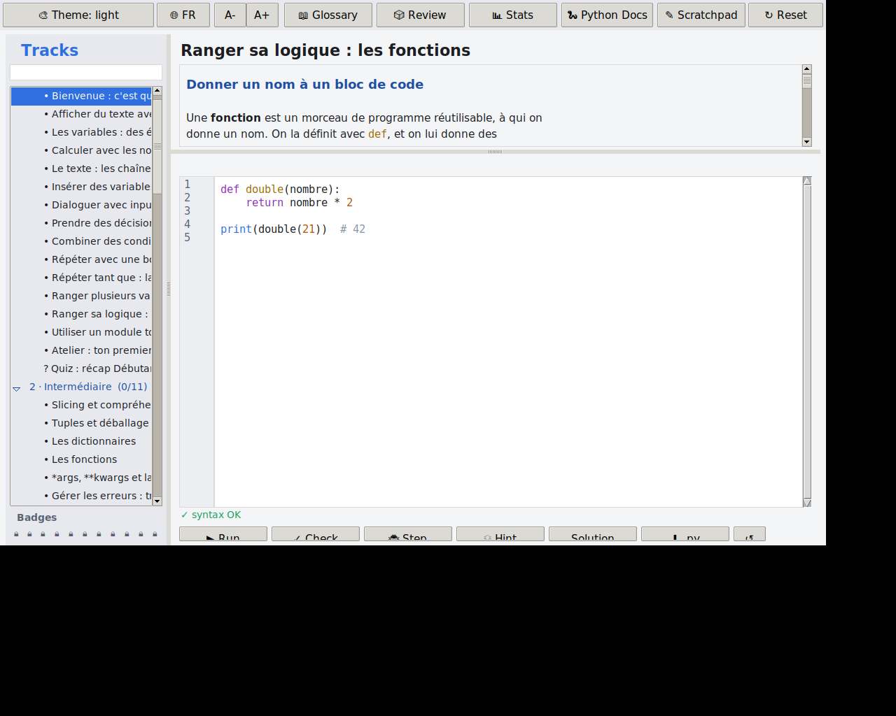

# PythonLearn 🐍

Une application de bureau pour **apprendre Python pas à pas, du niveau
débutant au niveau expert**. Chaque leçon mêle une explication claire et
un exercice que l'on résout dans un éditeur intégré : le code s'exécute
pour de vrai et la réussite est vérifiée automatiquement.

- ✅ Parcours structuré : **11 parcours, 105 exercices**, du tout débutant aux projets concrets
- ✅ Éditeur intégré avec **coloration syntaxique**, **numéros de ligne** et **exécution réelle**
- ✅ **Syntaxe vérifiée en temps réel** (ligne fautive soulignée), **autocomplétion** (Ctrl+Espace)
- ✅ **Exécution pas-à-pas** : avance ligne par ligne en voyant les variables et la sortie évoluer
- ✅ **Export** du code d'un exercice en fichier `.py`
- ✅ **Vérification automatique** des exercices, avec **messages d'erreur expliqués en français**
- ✅ **Inspecteur de variables** après exécution + **comparaison attendu/obtenu** en cas d'échec
- ✅ **Bac à sable** libre (« Brouillon ») pour expérimenter sans exercice
- ✅ **Indices progressifs** (dévoilés un par un) avant de révéler la solution
- ✅ **Quiz (QCM) à la fin de chaque parcours** et **projets guidés multi-étapes**
- ✅ **3 thèmes** (sombre / clair / contraste élevé) + **zoom** du texte
- ✅ **Glossaire** intégré, **mode révision**, **recherche** de leçon, lien vers la doc Python
- ✅ **Suivi de progression** (barre + compteurs par parcours) et **badges** par parcours
- ✅ **Série de jours (streak)**, objectif quotidien et **statistiques** (graphique 7 jours)
- ✅ **Révision espacée** : les exercices reviennent à intervalles croissants (1, 3, 7, 16… jours)
- ✅ **Certificat** de fin de parcours (HTML imprimable, à ton nom)
- ✅ Confort d'édition : auto-fermeture des parenthèses, `Ctrl+/` pour commenter, indentation de bloc
- ✅ **Interface bilingue FR / EN** (bascule en un clic ; le contenu des leçons reste en français)
- ✅ **Zéro dépendance** pour l'utilisateur (tout est en bibliothèque standard)
- ✅ **Bac à sable sécurisé** : le « Brouillon » limite les modules importables et l'accès fichier/système
- ✅ **Tests automatisés** du curriculum (les 105 solutions sont vérifiées par la CI)
- ✅ Exécutables Windows / macOS / Linux générés **automatiquement** par GitHub Actions

|  Thème sombre  |  Thème clair  |  Quiz (contraste élevé)  |
|:---:|:---:|:---:|
|  |  |  |

> *Captures réalisées en environnement de test ; les emojis des badges
> s'affichent normalement sur Windows et macOS.*

Le tableau de bord **Stats** (série, objectif, graphique 7 jours, révisions, certificats) :



L'**exécution pas-à-pas** (ligne courante surlignée, variables et sortie à chaque étape) :



L'**interface bilingue** — ici en anglais (le contenu des leçons reste en français) :



## ⌨️ Raccourcis

| Raccourci | Action |
|-----------|--------|
| `Ctrl + Entrée` | Exécuter le code |
| `Ctrl + Espace` | Autocomplétion (mots-clés et noms du code) |
| `Ctrl + /` | Commenter / décommenter la sélection |
| `Tab` / `Maj + Tab` | Indenter / désindenter la sélection |
| `Ctrl + +` / `Ctrl + -` / `Ctrl + 0` | Zoom avant / arrière / réinitialiser |

## 📚 Les parcours

Chaque parcours de cours se termine par un **quiz de récap**. Le dernier
parcours est entièrement consacré aux **projets guidés**.

**Fondamentaux**
1. **Débutant** — afficher, variables, calculs, texte, `input()`, conditions, boucles, listes, fonctions, modules, atelier + quiz.
2. **Intermédiaire** — slicing, compréhensions, tuples, dictionnaires, fonctions avancées, ensembles, modules, tri, exceptions + quiz.
3. **Avancé** — générateurs, POO complète, décorateurs, propriétés, fichiers, expressions régulières + quiz.
4. **Expert** — gestionnaires de contexte, dataclasses, `functools`, async, ABC, tests unitaires, `itertools` + quiz.

**Parcours pratiques (orientés projets)**

5. **Scripts & automatisation** — scripts, `pathlib`, fichiers, JSON, CSV, dates + quiz.
6. **Interfaces graphiques** — créer des fenêtres et des apps avec Tkinter + quiz.
7. **Python & le web** — HTTP, générer du HTML, lire une API, mini-serveur, Flask/Django + quiz.
8. **Administrer son PC** — système, variables d'environnement, fichiers, ranger un dossier + quiz.
9. **Bases de données (SQLite)** — créer une table, INSERT, SELECT, WHERE, UPDATE/DELETE, agrégats + quiz.
10. **Dessiner (turtle)** — polygones, motifs, spirales, coordonnées, rosace + quiz.

**Projets guidés** (multi-étapes, validés exercice par exercice)

11. **Projets guidés** — le **Pendu**, une **liste de tâches**, un **bloc-notes** Tkinter, un **convertisseur de devises**, le **Jeu de la vie** de Conway, et le **hachage sécurisé** d'un mot de passe.

---

## 🚀 Lancer l'application depuis les sources

Il suffit d'avoir Python 3.10 ou plus.

```bash
git clone https://github.com/<ton-compte>/python-learn.git
cd python-learn
python main.py
```

> **Linux** : si tkinter manque, installe-le avec
> `sudo apt install python3-tk`.
> **Windows / macOS** : tkinter est inclus avec l'installateur officiel
> de [python.org](https://www.python.org/downloads/).

---

## 📦 Récupérer l'exécutable (.exe)

Tu n'as **rien à compiler toi-même**. Deux options :

### Option A — via les Releases (recommandé)

1. Pousse le projet sur GitHub.
2. Crée un tag de version, par exemple :
   ```bash
   git tag v1.0.0
   git push origin v1.0.0
   ```
3. GitHub Actions construit automatiquement les exécutables Windows,
   macOS et Linux, puis les attache à une **Release**.
4. Va dans l'onglet **Releases** de ton dépôt et télécharge
   `PythonLearn-windows.exe`.

### Option B — build manuel local

```bash
pip install -r requirements-dev.txt
pyinstaller --onefile --windowed --name PythonLearn main.py
```

L'exécutable apparaît dans le dossier `dist/`.

> ℹ️ Sous Windows, SmartScreen peut afficher un avertissement pour un
> exécutable non signé : *Informations complémentaires → Exécuter quand
> même*. C'est normal pour une application personnelle non signée.

---

## ➕ Ajouter ou modifier des leçons

Tout le contenu pédagogique vit dans le dossier `content/`, un fichier
par niveau. Pour ajouter une leçon, ajoute simplement un dictionnaire à
la liste `lessons` du niveau voulu :

```python
{
    "id": "deb-08",                      # identifiant unique
    "title": "Ma nouvelle leçon",
    "content": "## Titre\n\nDu texte...\n```\nprint('exemple')\n```",
    "starter": "# code de départ\n",
    "expected_output": "résultat attendu",   # OU
    "check": "assert resultat == 42",        # code de test
    "solution": "resultat = 42\n",           # solution révélable
}
```

L'interface se met à jour automatiquement — aucune autre modification
n'est requise.

**Mini-balisage du champ `content` :**

| Syntaxe          | Rendu                          |
|------------------|--------------------------------|
| `## Titre`       | Sous-titre                     |
| `` ```...``` ``  | Bloc de code (monospace)       |
| `` `code` ``     | Code en ligne                  |
| `**gras**`       | Texte en gras                  |
| `- élément`      | Puce                           |

**Modes de validation d'un exercice :**

- `expected_output` : la sortie texte doit correspondre exactement ;
- `check` : du code Python exécuté ensuite (`assert ...`), avec accès aux
  variables/fonctions définies par l'apprenant ;
- `stdin` : liste de lignes simulant la saisie clavier (`input()`).

**Champs avancés (facultatifs) :**

- `hints` : liste d'indices dévoilés un par un (ou via `content/hints.py`) ;
- `type: "quiz"` + `question`, `options`, `answer` (index), `explanation` : une leçon QCM ;
- `exercices` : liste d'exercices (`prompt`, `starter`, `check`/`expected_output`,
  `solution`, `hints`) pour un projet multi-étapes affiché avec des onglets.

---

## 🗂️ Structure du projet

```
python-learn/
├── main.py                  # point d'entrée
├── app/
│   ├── ui.py                # interface principale
│   ├── editor.py            # éditeur (coloration, n° de ligne, confort)
│   ├── runner.py            # exécution + vérification + bac à sable
│   ├── errors.py            # explication pédagogique des erreurs
│   ├── stats.py             # streak, répétition espacée, certificat
│   ├── i18n.py              # traductions FR / EN de l'interface
│   ├── progress.py          # sauvegarde de la progression
│   └── icon.py              # icône embarquée (base64)
├── content/
│   ├── __init__.py          # agrégation + utilitaires du schéma
│   ├── debutant.py … admin.py   # les 8 parcours de cours
│   ├── sqlite_db.py         # parcours Bases de données (SQLite)
│   ├── dessin.py            # parcours Dessiner (turtle)
│   ├── projets.py           # projets guidés multi-exercices
│   ├── quiz_parcours.py     # un quiz de fin par parcours (injecté auto)
│   ├── hints.py             # indices progressifs
│   └── glossaire.py         # termes du glossaire
├── assets/                  # icônes + captures
├── tests/                   # tests automatiques du curriculum
├── .github/workflows/
│   ├── build.yml            # génération auto des exécutables
│   └── tests.yml            # validation du curriculum (CI)
├── requirements.txt
├── requirements-dev.txt
└── README.md
```

La progression est stockée dans `~/.python-learn/progress.json`
(dossier personnel de l'utilisateur).

---

## 📜 Licence

MIT — voir le fichier [LICENSE](LICENSE).
