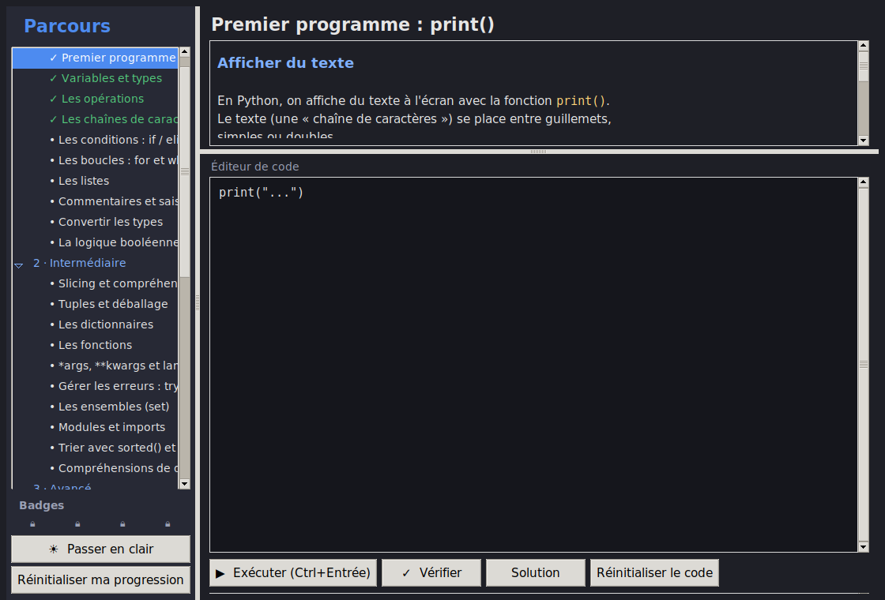
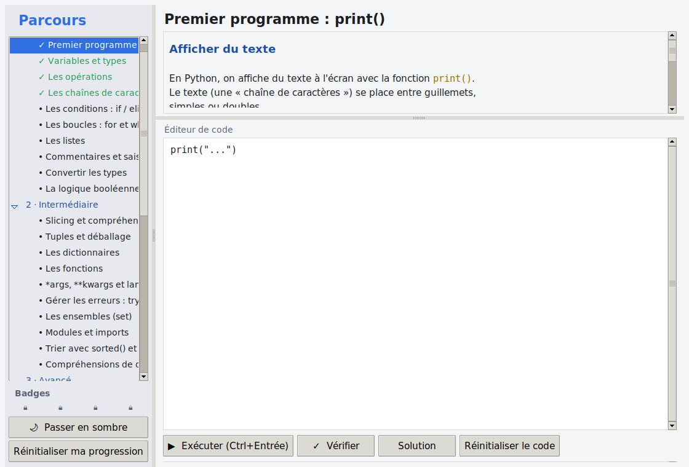

# PythonLearn 🐍

Une application de bureau pour **apprendre Python pas à pas, du niveau
débutant au niveau expert**. Chaque leçon mêle une explication claire et
un exercice que l'on résout dans un éditeur intégré : le code s'exécute
pour de vrai et la réussite est vérifiée automatiquement.

- ✅ Parcours structuré en 4 niveaux (Débutant → Intermédiaire → Avancé → Expert)
- ✅ Éditeur de code intégré avec **exécution réelle** et console de sortie
- ✅ **Vérification automatique** des exercices (le code est testé)
- ✅ **Suivi de progression** sauvegardé localement
- ✅ **Thème clair / sombre** commutable (mémorisé d'une session à l'autre)
- ✅ **Badges de réussite** débloqués à la fin de chaque niveau
- ✅ Solutions révélables, réinitialisation, raccourci `Ctrl+Entrée`
- ✅ **Zéro dépendance** pour l'utilisateur (tout est en bibliothèque standard)
- ✅ Exécutables Windows / macOS / Linux générés **automatiquement** par GitHub Actions

|  Thème sombre  |  Thème clair  |
|:---:|:---:|
|  |  |

> *Captures réalisées en environnement de test ; les emojis des badges
> s'affichent normalement sur Windows et macOS.*

---

## 🚀 Lancer l'application depuis les sources

Il suffit d'avoir Python 3.10 ou plus.

```bash
git clone https://github.com/<ton-compte>/python-learn.git
cd python-learn
python main.py
```

> **Linux** : si tkinter manque, installe-le avec
> `sudo apt install python3-tk`.
> **Windows / macOS** : tkinter est inclus avec l'installateur officiel
> de [python.org](https://www.python.org/downloads/).

---

## 📦 Récupérer l'exécutable (.exe)

Tu n'as **rien à compiler toi-même**. Deux options :

### Option A — via les Releases (recommandé)

1. Pousse le projet sur GitHub.
2. Crée un tag de version, par exemple :
   ```bash
   git tag v1.0.0
   git push origin v1.0.0
   ```
3. GitHub Actions construit automatiquement les exécutables Windows,
   macOS et Linux, puis les attache à une **Release**.
4. Va dans l'onglet **Releases** de ton dépôt et télécharge
   `PythonLearn-windows.exe`.

### Option B — build manuel local

```bash
pip install -r requirements-dev.txt
pyinstaller --onefile --windowed --name PythonLearn main.py
```

L'exécutable apparaît dans le dossier `dist/`.

> ℹ️ Sous Windows, SmartScreen peut afficher un avertissement pour un
> exécutable non signé : *Informations complémentaires → Exécuter quand
> même*. C'est normal pour une application personnelle non signée.

---

## ➕ Ajouter ou modifier des leçons

Tout le contenu pédagogique vit dans le dossier `content/`, un fichier
par niveau. Pour ajouter une leçon, ajoute simplement un dictionnaire à
la liste `lessons` du niveau voulu :

```python
{
    "id": "deb-08",                      # identifiant unique
    "title": "Ma nouvelle leçon",
    "content": "## Titre\n\nDu texte...\n```\nprint('exemple')\n```",
    "starter": "# code de départ\n",
    "expected_output": "résultat attendu",   # OU
    "check": "assert resultat == 42",        # code de test
    "solution": "resultat = 42\n",           # solution révélable
}
```

L'interface se met à jour automatiquement — aucune autre modification
n'est requise.

**Mini-balisage du champ `content` :**

| Syntaxe          | Rendu                          |
|------------------|--------------------------------|
| `## Titre`       | Sous-titre                     |
| `` ```...``` ``  | Bloc de code (monospace)       |
| `` `code` ``     | Code en ligne                  |
| `- élément`      | Puce                           |

**Modes de validation d'un exercice :**

- `expected_output` : la sortie texte doit correspondre exactement ;
- `check` : du code Python exécuté ensuite (`assert ...`), avec accès aux
  variables/fonctions définies par l'apprenant ;
- `stdin` : liste de lignes simulant la saisie clavier (`input()`).

---

## 🗂️ Structure du projet

```
python-learn/
├── main.py                  # point d'entrée
├── app/
│   ├── ui.py                # interface graphique (thème, badges, éditeur)
│   ├── runner.py            # exécution + vérification du code
│   ├── progress.py          # sauvegarde de la progression
│   └── icon.py              # icône embarquée (base64)
├── content/
│   ├── __init__.py          # agrégation du curriculum
│   ├── debutant.py          # 10 leçons
│   ├── intermediaire.py     # 10 leçons
│   ├── avance.py            # 10 leçons
│   └── expert.py            # 10 leçons
├── assets/
│   ├── icon.ico / .icns / .png   # icônes pour le build
│   └── screenshot-*.png
├── .github/workflows/build.yml   # génération auto des exécutables
├── requirements.txt
├── requirements-dev.txt
└── README.md
```

La progression est stockée dans `~/.python-learn/progress.json`
(dossier personnel de l'utilisateur).

---

## 📜 Licence

MIT — voir le fichier [LICENSE](LICENSE).
